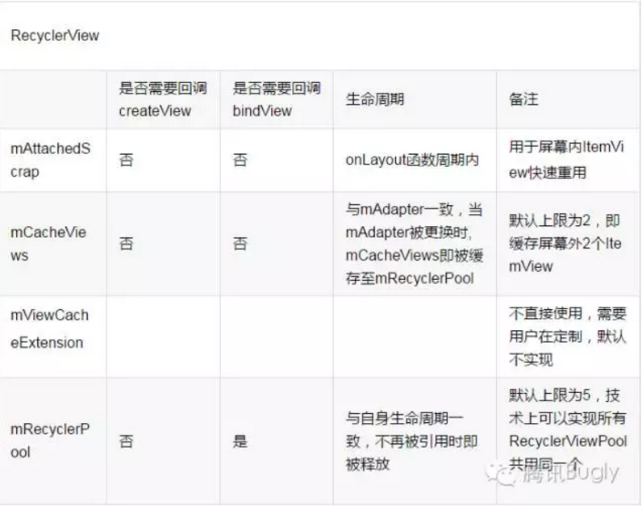
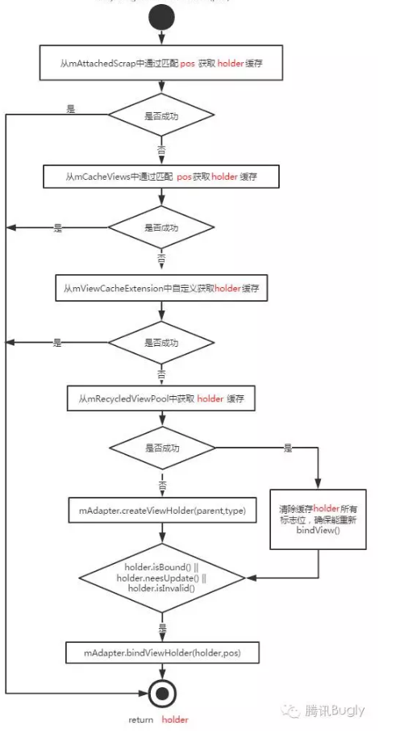

# RecyclerView简单分析

## 工作流程图

## 一些结论

* `RecyclerView`将其`measure`与`layout`过程委托给了`LayoutManager`来处理。

* RecyclerView的Adapter中被缓存的单位是ViewHolder，而ListView中缓存的则是View

* RecyclerView.Recycler类中mAttachedScrap、mChangedScrap、mCachedViews几个ViewHolder列表对象，它们就是用于缓存ViewHolder的。

* 通过LayoutState的next函数获取Item View时，实际上调用的是RecyclerView.Recycler的getViewForPosition函数，该函数首先会从这几个ViewHolder缓存中获取对应位置的Viewholder，如果没有缓存则调用RecyclerView.Adapter中的createViewHolder函数创建一个新的ViewHolder。createViewHolder函数中回调 **onCreateViewHolder()**。

* 调用了Adapter的createViewHolder后，会调用Adapter.bindViewHolder()，在bindViewHolder函数中回调了 **onBindViewHolder()**。

* RecyclerView与ListView最大的不同是RecyclerView将布局的工作交给了LayoutManager，在LayoutManager的onLayoutChildren中对ItemView进行布局、执行动画等操作，减小了耦合，使RecyclerView有更好的扩展性。

## RecyclerView 的四级缓存

如果是预布局，那么从`mChangedScrap`中查找，如果查找失败的话，从`mAttachedScrap`中进行查找，依旧失败的话从`mCachedViews`中查找。

如果开发者设置了`ViewCacheExtension`的话，就会继续`ViewCacheExtension`中进行查找`View`，然后根据`View`生成`ViewHolder`。否则的话就会从`RecycledViewPool`进行查找。最后才会调用`Adapter`的`createViewHolder`方法。

从`RecycledViewPool`中获取的`ViewHolder`要清除所有的标志位。

从`mCachedViews`（屏幕外的`ViewHolder`，最多缓存两条）获取缓存的时候，是通过`pos`获取目标位置的缓存，当数据源不变的情况下，不必重新`bind`。

onLayout分为3步：

1. `dispatchLayoutStep1()`

  记录刷新到列表项ItemView的各种信息，如`top`、`right`、`bottom`、`left`，用于动画的相关计算。

2. `dispatchLayoutStep2()`

  真正测量布局大小、位置，并且调用了`layoutChild()`。

3. `dispatchLayoutStep3()`

  计算布局前后各个`ItemView`的状态 ，如`remove`、`add`等，如有必要会执行相关的动画。

## `LinearLayoutManager.onLayoutChildren()`算法分析

1. by checking children and other variables, find an anchor coordinate and an anchor
2. item position.
3. fill towards start, stacking from bottom
4. fill towards end, stacking from top
5. scroll to fulfill requirements like stack from bottom.

确定布局锚点，以此为起点向开始方向和结束方向填充`ItemView`。调用两次`fill()`方法。

`fill()`方法中会循环调用`layoutChunk`方法，循环的条件是*是否还有剩余空间*或者*已经填充完毕*。

`layoutChunk`中是获取ItemView然后调用`RecyclerView.addView()`方法把`ItemView`添加到布局中。另外还会调用`layoutDecorated`方法。

scrapped、cached和exCached集合定义在RecyclerView.Recycler中，分别表示将要在RecyclerView中删除的ItemView、一级缓存ItemView和二级缓存ItemView，cached集合的大小默认为２，exCached是需要我们通过RecyclerView.ViewCacheExtension自己实现的，默认没有；

scrapped集合中存储的其实是正在执行REMOVE操作的ItemView。

`recycleViewHolderInternal`：首先判断集合cached是否満了，如果已満就从cached集合中移出一个到recycled集合中去，再把新的ItemView添加到cached集合；如果不満就将ItemView直接添加到cached集合。
